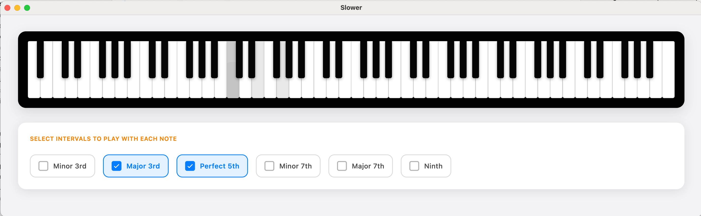

# Diatonic

**Diatonic* is a simple piano 
keyboard for when you want to quickly play some notes put aren't near a piano. It is intended as a 
support tool for composition and transcription. It also includes a media player with 
time warping to assist with learning and transcribing music, or playing back tracks.

Built using [Flutter](https://flutter.dev). Flutter is cross platform, and thus Slower is too. However, to date it has only been built on MacOS. Builds on Windows and Linux platforms still to come.

---

## ✨ Features

- **Real piano note samples**
- **Play desired intervals and chords** by just playing the root note.
- **Mouse or Keyboard control**
- Integrated media player with time warping

---

## 🖥️ Screenshot



---

## 🛠️ Installation

### Coming Soon: Pre-built binary

As binaries become available you will be able to downloae pre-build binaries.

### 🧪 Build from source (MacOS)

1. Install Flutter with macOS desktop support  
   [Flutter installation guide](https://docs.flutter.dev/get-started/install)

2. Clone the repo, build, and install.

```bash
git clone https://github.com/ejkreboot/diatonic.git
cd diatonic
chmod 755 scripts/macos_build.sh
./scripts/macos_build.sh
```

### 🧪 Build from source (Other desktop environments)

Untested, but the following should work, or nearly work

```
flutter clean
flutter pub get
flutter build [platform] --release
```

(Where `platform` is either `windows` or `linux`.)

The resulting binary should then be in `./build/[platform]/Build/Products/Release`